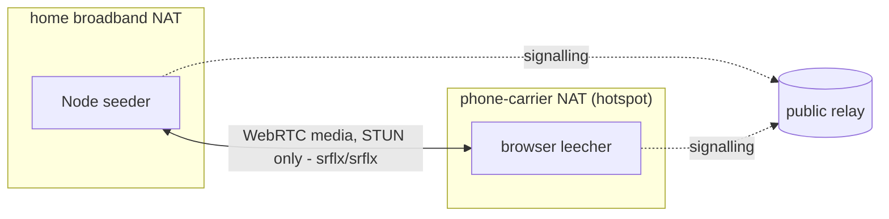

# Feasibility spike results

Measurements taken 10 August 2026 with the code in this directory. These
spikes are deliberately throwaway: star topology, push-to-all, no
scheduling, no hls.js. They exist to answer "will this actually work"
before the real engine is built, and each one either passed or taught a
design decision. All transfers are SHA-256 verified end to end - a
transport check against the hash the sending peer supplied, which catches
corruption but not a malicious seeder (who controls both bytes and hash);
origin-authenticated digests are engine work, stated in the README.

**Relay provenance.** The two-peer PoC measurements and the 10-leecher
fan-out receipt ran over public relays (relay.damus.io, nos.lol,
relay.primal.net). Unless a row says otherwise, the other spike runs
signalled over `wss://relay.trotters.cc`, an author-operated relay - the
pre-announcement policy kept the experimental swarm kinds off the major
public relays. Every spike reproduces against relays of your choosing with
`--relay`.

## Concurrency and cadence (Node peers, `fanout.mjs` / `cadence.mjs`)

| Run | Setup | Result |
|---|---|---|
| Fan-out, 5 leechers | 1 seeder, 2MB each, 400ms staggered arrivals, public relays | 5/5 verified, avg signalling 592ms, all end-to-end < 2s |
| Fan-out, 10 leechers | 1 seeder, 2MB each, 400ms stagger, public relays (receipt in `spikes/results/`) | 10/10 verified, avg signalling 571ms, wall 4.9s; the whole swarm's signalling bill was **23 unique signed events** (3 presence + 10 offers + 10 answers, 62 relay writes) to move 20MB |
| Fan-out via a single relay | Same test, one relay instead of three (self-hosted, author-operated) | 5/5 verified, avg signalling 956ms - a stream naming one swarm relay is viable |
| Sustained cadence | 2MB every 4s for 5 minutes to 3 leechers (a simulated 4Mbps live stream) | 225/225 segments verified, **100% deadline hit rate**, transfer p50 570ms / p95 917ms / max 1.9s |

## Real browsers (`browser-peer.html` + `seeder.mjs`)

| Run | Setup | Result |
|---|---|---|
| Chrome 151 leecher | Native WebRTC, in-page nostr-tools signalling, vs the Node seeder | 2MB verified, 13.5MB/s, end-to-end 3.2s |
| Safari 17.6 leecher | Same | 2MB verified, 12.7MB/s, end-to-end 2.8s |
| Two machines over wifi | Second laptop's Safari vs the Node seeder, same LAN | 2MB verified, 9.4MB/s over the radio, signalling 829ms |
| Browser-to-browser | Remote browser as seeder, local Chrome as leecher, no Node peer at all | 2MB verified, 4.0MB/s, ICE pair host/prflx |
| Handheld leecher | Phone-class handheld over LAN wifi (mobile-Safari-class browser; the device reported a desktop-class UA, so exact model is unconfirmed - one untuned sample) | 2MB verified; 0.4MB/s on this device - fine for 6s segments, marginal for 4s, and untuned (receive-path tuning is engine work) |

Playback engines confirmed separately via the public hls.js demo: iPhone
(iOS 26, ManagedMediaSource) and GrapheneOS Vanadium (MSE) both play.

## NAT reality (`crossnat` runs of `browser-peer.html`)

| Run | Setup | Result |
|---|---|---|
| Cross-NAT, STUN only | Laptop tethered to a phone hotspot (no LAN path) vs seeder on home broadband, signalling via relay | Connected and verified; repeat run's ICE pair **srflx/srflx** - pure STUN traversal both sides. Segment fully dispatched 1.1s after the offer |
| Behind a commercial VPN, on LAN | VPN active, both machines on one LAN | Verified, but ICE used the LAN path (remote candidate `host`) - VPNs that allow local networks get bypassed by ICE, so this run says nothing about VPN traversal |
| Behind a commercial VPN, on hotspot | No LAN path, VPN egress only | Signalling worked through the tunnel; **STUN-only ICE failed, reproduced twice** (60s timeout). Symmetric NAT at the VPN egress |
| Background tab | Chrome seeder tab backgrounded 75s before the leecher arrived | Transfer unimpaired once connected (643ms, 3.1MB/s); discovery slowed to 16s because timer-driven announces get throttled |

## What the failures decided

- **Hard NATs get topology, not TURN.** A TURN server relays every media
  byte at the same cost as the origin serving directly, and the origin is
  already the fallback. Symmetric-NAT clients (VPN egress, CGNAT) can
  often dial out to a publicly reachable peer, so super-peers absorb much
  of the hard-NAT population with plain WebRTC - not where UDP or WebRTC
  itself is blocked, where plain HLS from the origin remains the universal
  fallback. TURN only if wild data demands it.
- **Announce direction matters.** Background tabs answer WebSocket
  messages instantly but run timers slowly, so the protocol should have
  arriving peers announce and existing peers respond, not seeders beacon
  on an interval.

## Caveats, stated honestly

- Cross-NAT is one real NAT pair (home broadband vs one mobile carrier)
  and the VPN rows are one provider. Wide sampling across carriers, CGNAT
  variants and VPNs is engine-phase work.
- Firefox is untested (not installed on the measurement machines). iOS
  Safari is confirmed for hls.js playback (ManagedMediaSource) but has not
  yet run the swarm leecher flow itself.
- Browser signalling includes a non-trickle ICE gathering wait (capped
  1.2s); trickle ICE is a deliverable-era optimisation that removes it.

Reproduce any of it: `node spikes/fanout.mjs`, `node spikes/cadence.mjs`,
or `node spikes/run-browser-test.mjs` (macOS) against relays of your
choosing with `--relay`.
